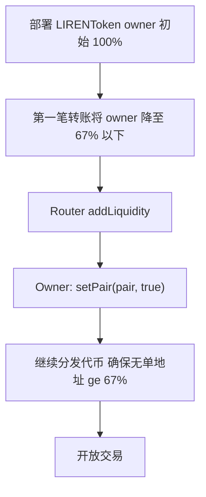
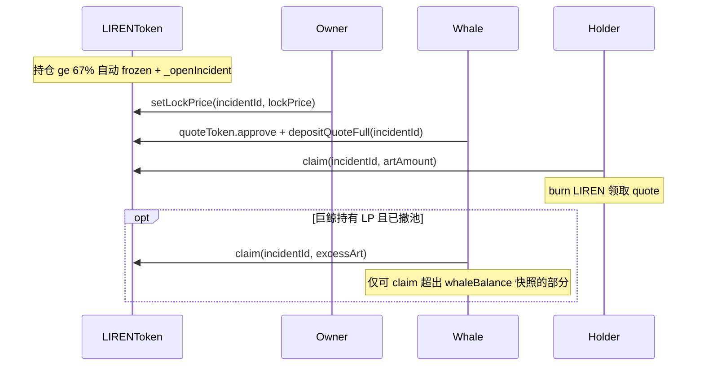
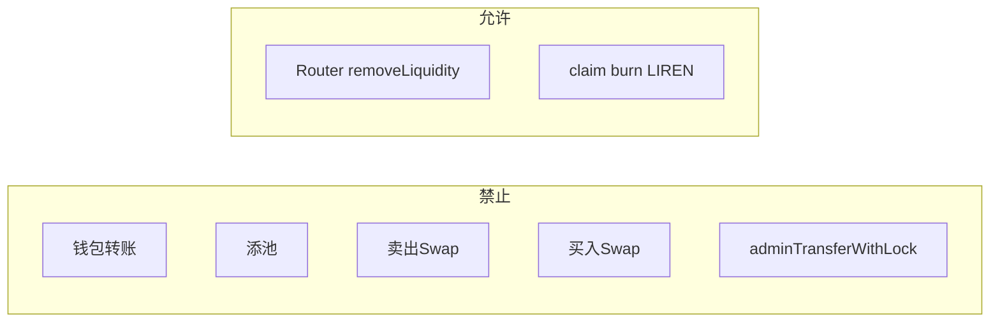

# LIRENToken 合约使用说明

> Solidity 版本：`^0.8.28`  
> 依赖：OpenZeppelin `ERC20`、`Ownable`、`ReentrancyGuard`、`SafeERC20`

---

## 1. 概述

`LIRENToken` 是面向 **PancakeSwap V2** 的 LIREN 代币合约（ERC20 名称 `LI REN XING TOKEN`，符号 `LIREN`），在标准 ERC20 基础上扩展：

1. **链上艺术品元数据**：IPFS CID、作品名、艺术家、描述等；
2. **67% 巨鲸永久冻结**：单地址持仓 ≥ 67% 时自动冻结全网转账与 Swap，**不可逆**（无 `unfreeze`）；
3. **冻结期 V2 撤池**：通过 LP `totalSupply` checkpoint 识别合法撤池；**不支持 V3**，无需 Helper 合约；
4. **管理员锁仓分发**：固定锁仓 + 线性释放，代币直接转入受益人钱包；
5. **内置补偿金库**：巨鲸注入 quote token 后，持有者 burn LIREN 领取 quote；巨鲸本人仅可 claim 超出事件快照 `whaleBalance` 的部分（如冻结后从 LP 撤池返还的 LIREN）。

### 核心设计

| 特性 | 说明 |
|------|------|
| 固定总量 | 10 亿枚（18 位小数），constructor 一次性 mint 给 `initialOwner` |
| 默认开启巨鲸检测 | 部署后 `whaleCheckEnabled = true` |
| 永久冻结 | 首次触发时 `frozen = true` 且 `frozenPermanent = true` |
| V2 撤池 | 同一笔交易内 Pair LP `totalSupply` 下降时允许 Pair → 用户 |
| Owner 不豁免 | owner 持仓 ≥ 67% 同样触发永久冻结 |
| 无解冻 | 冻结后不可恢复普通转账与 Swap |

### 继承关系

```
LIRENToken
├── ERC20           // transfer、balanceOf 等标准接口
├── Ownable         // onlyOwner 管理方法
└── ReentrancyGuard // claim 防重入
```

---

## 2. 常量

| 名称 | 值 | 说明 |
|------|-----|------|
| `TOTAL_SUPPLY` | `1_000_000_000 × 10^18` | 代币总供应量 |
| `WHALE_THRESHOLD` | `670_000_000 × 10^18` | 巨鲸阈值（总量的 67%） |
| `PRICE_PRECISION` | `1e18` | 补偿价格与数量换算精度 |
| `BURN_ADDRESS` | `0x000000000000000000000000000000000000dEaD` | 销毁地址；claim 时将 LIREN 转入此地址 |

---

## 3. 状态变量与结构体

### 冻结与补偿

| 名称 | 类型 | 说明 |
|------|------|------|
| `frozen` | `bool` | 是否处于全网冻结状态 |
| `frozenPermanent` | `bool` | 是否已永久冻结（触发 67% 后为 `true`，且不可再改 Pair 配置） |
| `whaleCheckEnabled` | `bool` | 是否启用巨鲸持仓检测 |
| `lastWhale` | `address` | 最近一次触发冻结的巨鲸地址 |
| `quoteToken` | `IERC20`（immutable） | 补偿使用的 quote token（如 USDT），部署后不可更改 |
| `incidentId` | `uint256` | 已累计创建的补偿事件总数（一次冻结模型下触发后为 `1`） |
| `incidents` | `mapping(uint256 => Incident)` | 补偿事件详情（public getter） |
| `claimedArt` | `mapping(uint256 => mapping(address => uint256))` | 各用户在各事件中已 burn 的 LIREN 累计量 |

### Incident 结构体

| 字段 | 类型 | 说明 |
|------|------|------|
| `whale` | `address` | 触发冻结的巨鲸地址 |
| `whaleBalance` | `uint256` | 开事件时巨鲸的 LIREN 持仓快照 |
| `lockPrice` | `uint256` | 补偿单价：1 枚 LIREN 对应的 quote 数量；`0` 表示尚未设价 |
| `requiredQuote` | `uint256` | 设价后计算的巨鲸需注入 quote 总量 |
| `totalDeposited` | `uint256` | 巨鲸已累计注入的 quote 数量 |

### Pancake V2 Pair

| 名称 | 类型 | 说明 |
|------|------|------|
| `_pairsEnabled` | `mapping(address => bool)` | 已注册的 Pair（公开查询用 `isPair(pair)`） |
| `_pairs` | `address[]` | 已注册 Pair 列表（通过 `pairsCount` / `pairAt` 遍历） |
| `_lpSupplyCheckpoint` | `mapping(address => uint256)` | 各 Pair 的 LP 供应量快照（公开 getter：`lpSupplyCheckpoint(pair)`） |

### VestingSchedule 结构体

`mapping(address => VestingSchedule[]) private _vestingSchedules`

| 字段 | 类型 | 说明 |
|------|------|------|
| `fixedAmount` | `uint256` | 固定锁仓数量，到期后一次性计入 vested |
| `linearAmount` | `uint256` | 线性释放数量 |
| `fixedLockEndTime` | `uint256` | 固定锁仓到期时间戳（Unix 秒） |
| `linearDuration` | `uint256` | 线性释放时长（秒）；`linearAmount > 0` 时必填 |

锁仓代币存放在受益人钱包；未解锁部分在 `_update` 转出时受限。

### ArtworkInfo 结构体

| 字段 | 类型 | 说明 |
|------|------|------|
| `vaultFilesIpfsCID` | `string` | 元数据/预览图 IPFS CID |
| `originalIpfsCID` | `string` | 艺术品原件 IPFS CID |
| `artworkName` | `string` | 作品名称 |
| `artist` | `string` | 艺术家 |
| `description` | `string` | 作品描述 |

通过 `getArtworkInfo()` 读取；部署后不可修改，owner 无更新入口。

---

## 4. 角色与权限

| 角色 | 可调用方法 |
|------|-----------|
| Owner | `setPair`、`enableWhaleCheck`、`adminTransferWithLock`、`setLockPrice` |
| 巨鲸（`incident.whale`） | `depositQuote`、`depositQuoteFull`；冻结后撤池所得超出 `whaleBalance` 的部分可 `claim` |
| 合格 LIREN 持有者 | `claim` |
| 锁仓受益人 | `transfer` / `transferFrom`（仅已解锁部分；冻结期禁止） |
| 任意地址 | ERC20 标准方法 + 所有 view |
| 链上自动 | `_update` 内 `_checkWhale` 检测持仓并可能触发冻结与 `_openIncident` |

> **注意**：Owner **不豁免** 67% 巨鲸检测；Pair 地址持仓不计入巨鲸检测。

---

## 5. 业务流程

### 5.1 上线推荐流程



**关键顺序**：部署后 owner 初始持有 100%，第一笔非 mint 转账后会检查 owner 余额；因此第一笔转账必须一次性让 owner 余额降到 67% 以下，且接收方也不能达到 67%。建池完成后调用 `setPair(true)` 同步 LP `totalSupply` checkpoint，冻结期才能正确识别撤池。

### 5.2 67% 冻结与补偿流程



| 步骤 | 操作 | 执行方 |
|------|------|--------|
| 1 | 部署 LIRENToken（constructor 传入 `quoteToken_`） | 部署者 |
| 2 | 创建 Pair、添加流动性 | Owner / 脚本 |
| 3 | `setPair(pair, true)` | Owner |
| 4 | 分发代币，确保无单地址 ≥ 67% | Owner |
| 5 | 某地址持仓 ≥ 67% 触发冻结 | 链上自动 |
| 6 | 自动 `_openIncident(whale, whaleBalance)` | 合约内部 |
| 7 | `setLockPrice(incidentId, lockPrice)` | Owner |
| 8 | `depositQuoteFull(incidentId)` 或分批 `depositQuote` | 巨鲸 |
| 9 | `claim(incidentId, artAmount)` | 合格持有者（含巨鲸超出 `whaleBalance` 的部分） |

### 5.3 巨鲸冻结机制

每次非 mint 转账（`from != address(0)`）完成后，若 `whaleCheckEnabled`，会对 `from` 和 `to` 分别调用 `_checkWhale`。

**排除检测的地址**：

| 地址 | 原因 |
|------|------|
| `address(0)` | mint 等特殊场景 |
| `BURN_ADDRESS` | 销毁地址 |
| `address(this)` | 合约自身 |
| `isPair(account) == true` | 已注册 Pancake V2 Pair |

**触发条件**：`balanceOf(account) >= WHALE_THRESHOLD` 且当前 `frozen == false`（仅首次触发）。

触发后：`frozen = true`、`frozenPermanent = true`、`lastWhale = account`，并自动开 Incident。

### 5.4 冻结期转账规则

冻结期间，`_update` 在调用 `super._update` 之前拦截不允许的转账。

| 操作 | 冻结后结果 |
|------|-----------|
| 普通钱包转账 | revert `TransferFrozen` |
| 添池 addLiquidity | revert |
| 卖出 Swap（用户 → Pair） | revert |
| 买入 Swap（Pair → 用户，LP 未 burn） | revert |
| 撤池 removeLiquidity（Router，LP burn） | **成功** |
| `claim`（用户 → BURN_ADDRESS） | **成功** |
| `adminTransferWithLock` | revert |

**撤池检测原理**：PancakeSwap V2 撤池时 Pair 会 burn LP，同一笔交易内 LP `totalSupply` 下降：

```
_isRemoveLiquidityV2(pair) = IERC20(pair).totalSupply() < lpSupplyCheckpoint(pair)
```

每次涉及已注册 Pair 的 LIREN 转账完成后，会更新该 Pair 的 LP supply 快照。

**加池与 checkpoint 的时序**：Pancake V2 加池时 Router 先将底层资产转入 Pair，随后 Pair 才 `mint()` 增发 LP。因此 LIREN 转入 Pair 触发的 checkpoint 同步可能发生在 LP `mint()` 之前，快照会短暂低于真实 LP 供应量。若冻结前有人加池后又只撤出一部分新增流动性，过低的 checkpoint 可能导致部分撤池被误判为 swap。

**冻结时重同步**：首次触发 67% 永久冻结时，合约会遍历所有已注册 Pair，将 `lpSupplyCheckpoint` 强制对齐为当前 `IERC20(pair).totalSupply()`，从而修复上述边界情况。冻结后每次成功撤池仍会按惯例更新 checkpoint；买入 swap 因 LP 供应量不变，仍无法满足 `currentSupply < checkpoint`。



---

## 6. 公式附录

### 补偿金库

**巨鲸需注入总量（设价时自动计算）：**

```
requiredQuote = lockPrice × (TOTAL_SUPPLY - whaleBalance) / PRICE_PRECISION
```

**用户 claim 领取 quote：**

```
quoteOut = artAmount × lockPrice / PRICE_PRECISION
```

**可 burn 的 LIREN 上限（`_maxClaimableArt`）：**

```
若 account == incident.whale：
    maxClaimableArt = max(0, balanceOf(account) - incident.whaleBalance)
否则：
    maxClaimableArt = balanceOf(account)
```

- `artAmount`：用户指定 burn 的 LIREN 数量
- 须 `artAmount <= maxClaimableArt`（巨鲸仅可 claim 超出开事件时钱包快照的部分；主要来自冻结后 LP 撤池返还）
- 冻结期 claim burn 不受 vesting 限制（`isClaimBurn` 路径绕过 `unlockedBalance` 检查）
- LIREN 转入 `BURN_ADDRESS`，quote 从合约转出给调用者

**数值示例**：

- 巨鲸持仓 6.7 亿 LIREN，`lockPrice = 2e18`（1 LIREN = 2 USDT）
- `nonWhaleArt = 10亿 - 6.7亿 = 3.3亿`
- `requiredQuote = 3.3亿 × 2 = 6.6亿 USDT`（巨鲸需存入）
- 普通用户 burn 100 万 LIREN → 领取 200 万 USDT
- 巨鲸冻结时 `whaleBalance = 6.7亿`，撤池后钱包增至 7.0 亿 → 最多可 claim `3000 万 LIREN` → 领取 6000 万 USDT；claim 后余额回落至快照水平，不可再 claim

### 锁仓释放

**单条 schedule 已解锁量：**

```
若 block.timestamp < fixedLockEndTime：
    vested = 0
否则：
    vested = fixedAmount
    若 linearAmount > 0：
        elapsed = min(block.timestamp - fixedLockEndTime, linearDuration)
        vested += linearAmount × elapsed / linearDuration
```

**可转出余额：**

```
locked = Σ (schedule 总量 - vested(schedule))
unlockedBalance(account) = max(0, balanceOf(account) - locked)
```

**数值示例**：

```solidity
adminTransferWithLock(
    alice,
    3_000 ether,              // fixedLockAmount
    7_000 ether,              // linearAmount
    block.timestamp + 30 days,// fixedLockEndTime
    60 days                   // linearDuration
);
```

- 分发后：alice 余额 10,000 LIREN，`unlockedBalance = 0`
- 第 31 天：可转出 `3_000 + 7_000 × (1 day / 60 days)` LIREN
- 第 90 天（30 + 60）：可转出全部 10,000 LIREN

---

## 7. 方法参考

### constructor

```solidity
constructor(
    string memory vaultFilesIpfsCID_,
    string memory originalIpfsCID_,
    string memory artworkName_,
    string memory artist_,
    string memory description_,
    address initialOwner_,
    IERC20 quoteToken_
)
```

| 项目 | 说明 |
|------|------|
| 权限 | 部署时调用一次 |
| ERC20 name / symbol | 写死：`LI REN XING TOKEN` / `LIREN` |

| 参数 | 类型 | 说明 |
|------|------|------|
| `vaultFilesIpfsCID_` | `string` | 元数据/预览图 IPFS CID |
| `originalIpfsCID_` | `string` | 艺术品原件 IPFS CID |
| `artworkName_` | `string` | 作品名称 |
| `artist_` | `string` | 艺术家 |
| `description_` | `string` | 作品描述 |
| `initialOwner_` | `address` | 接收全部 `TOTAL_SUPPLY` 的地址，同时为 Ownable owner |
| `quoteToken_` | `IERC20` | 补偿用 ERC20 地址（须支持 `transfer` / `transferFrom`） |

| 副作用 | mint 10 亿枚至 `initialOwner_`；`whaleCheckEnabled = true` |

---

### getArtworkInfo

```solidity
function getArtworkInfo() external view returns (
    string memory vaultFilesIpfsCID,
    string memory originalIpfsCID,
    string memory artworkName,
    string memory artist,
    string memory description
)
```

| 项目 | 说明 |
|------|------|
| 权限 | 任意 |
| 返回值 | 当前链上艺术品元数据五字段 |

---

### setPair

```solidity
function setPair(address pair, bool enabled) external onlyOwner
```

| 参数 | 说明 |
|------|------|
| `pair` | PancakeSwap V2 Pair 合约地址（非 Router） |
| `enabled` | `true` 注册 / `false` 取消注册 |

| Revert | `FrozenConfigLocked`（`frozenPermanent == true` 时不可调用） |
| 事件 | `PairUpdated(pair, enabled)` |
| 副作用 | 启用时加入 Pair 列表并同步 LP checkpoint |

> **重要**：须在 67% 触发永久冻结**之前**完成注册；未注册的 Pair 在冻结期无法正确放行撤池。

---

### isPair

```solidity
function isPair(address pair) public view returns (bool)
```

| 返回值 | 该地址是否为已注册 Pair |

---

### lpSupplyCheckpoint

```solidity
function lpSupplyCheckpoint(address pair) external view returns (uint256)
```

| 参数 | 说明 |
|------|------|
| `pair` | Pair 地址 |

| 返回值 | 该 Pair 最近一次同步的 LP `totalSupply` 快照 |

---

### areSwapsBlocked

```solidity
function areSwapsBlocked() external view returns (bool)
```

| 返回值 | 等同 `frozen`；前端可用于禁用 Swap UI |

---

### pairsCount / pairAt

```solidity
function pairsCount() external view returns (uint256)
function pairAt(uint256 index) external view returns (address)
```

| 参数 | 说明 |
|------|------|
| `index` | Pair 列表下标，从 `0` 到 `pairsCount() - 1` |

| 用途 | 遍历已注册 Pair 列表 |

---

### enableWhaleCheck

```solidity
function enableWhaleCheck() external onlyOwner
```

| Revert | `FrozenConfigLocked`（永久冻结后不可调用） |
| 事件 | `WhaleCheckEnabled(admin)` |
| 副作用 | `whaleCheckEnabled = true` |

> 合约无 `disableWhaleCheck`；部署后默认已开启。

---

### setLockPrice

```solidity
function setLockPrice(uint256 incidentId_, uint256 lockPrice_) external onlyOwner
```

| 参数 | 说明 |
|------|------|
| `incidentId_` | 补偿事件 ID，通常为 `incidentId()`（触发冻结后为 `1`） |
| `lockPrice_` | 1 枚 LIREN 对应的 quote 数量，精度 `PRICE_PRECISION`（`1e18`）；例：`2e18` 表示 1 LIREN = 2 quote |

| Revert | `InvalidIncident`、`PriceAlreadySet`、`PriceNotSet`（价格为 0） |
| 事件 | `LockPriceSet(incidentId, lockPrice, requiredQuote)` |
| 副作用 | 写入 `lockPrice` 与 `requiredQuote`；每个 incident **仅可设价一次** |

---

### depositQuote

```solidity
function depositQuote(uint256 incidentId_, uint256 amount) external
```

| 参数 | 说明 |
|------|------|
| `incidentId_` | 补偿事件 ID |
| `amount` | 本次注入的 quote 数量（须 > 0） |

| 权限 | 仅该事件的 `whale` 地址 |
| 前置条件 | 已 `setLockPrice`；巨鲸须先 `quoteToken.approve(LIRENToken, amount)` |
| Revert | `InvalidIncident`、`NotWhale`、`PriceNotSet`、`NotClaimable`（amount 为 0）、`DepositExceedsRequired` |
| 事件 | `QuoteDeposited(incidentId, whale, amount)` |
| 副作用 | quote 转入合约；按实际到账额增加 `totalDeposited` |

---

### depositQuoteFull

```solidity
function depositQuoteFull(uint256 incidentId_) external
```

| 参数 | 说明 |
|------|------|
| `incidentId_` | 补偿事件 ID |

| 权限 | 仅该事件的 `whale` 地址 |
| 前置条件 | 已 `setLockPrice`；approve 剩余需存金额 |
| 行为 | 尝试一次性存入 `requiredQuote - totalDeposited`；实际到账不足时可继续补存 |
| Revert | `InvalidIncident`、`NotWhale`、`PriceNotSet`、`NotClaimable`（已全部存入） |
| 事件 | `QuoteDeposited(incidentId, whale, remaining)` |
| 副作用 | 按实际到账额增加 `totalDeposited` |

---

### claim

```solidity
function claim(uint256 incidentId_, uint256 artAmount) external nonReentrant
```

| 参数 | 说明 |
|------|------|
| `incidentId_` | 补偿事件 ID |
| `artAmount` | 本次 burn 的 LIREN 数量（须 > 0 且 ≤ `_maxClaimableArt(msg.sender, incident)`） |

| 权限 | 满足 `_canClaim` 的 LIREN 持有者 |
| 前置条件 | 巨鲸已存满 `requiredQuote`（`totalDeposited >= requiredQuote`） |
| Revert | `InvalidIncident`、`PriceNotSet`、`InsufficientWhaleDeposit`、`NotClaimable`、`InsufficientBalance`、`InsufficientVaultBalance` |
| 事件 | `QuoteClaimed(incidentId, claimant, artAmount, quoteOut)` |
| 副作用 | `artAmount` LIREN 转入 `BURN_ADDRESS`；按 `lockPrice` 转出 quote；更新 `claimedArt` |

> 用户**无需** approve LIREN；合约内部 `_transfer` 至 burn 地址。

**不可 claim 的地址**：零地址、合约自身、burn 地址、已注册 Pair。

**巨鲸 claim 限制**：仅可 burn 超出 `incident.whaleBalance` 快照的 LIREN（`balanceOf(whale) - whaleBalance`）。开事件时钱包内的巨鲸持仓本身不可 claim，须通过 `depositQuote` 履行补偿义务；冻结后从 LP 撤池返还的增量可 claim。

---

### requiredQuote

```solidity
function requiredQuote(uint256 incidentId_) external view returns (uint256)
```

| 返回值 | 该事件巨鲸需注入的 quote 总量；未设价时为 `0` |

---

### claimable

```solidity
function claimable(address user, uint256 incidentId_) external view returns (uint256)
```

| 参数 | 说明 |
|------|------|
| `user` | 查询地址 |
| `incidentId_` | 补偿事件 ID |

| 返回值 | 用户当前**最多可领取的 quote 数量**（非 LIREN 数量）；无资格或未存满时为 `0`；受合约 quote 余额上限约束 |

计算逻辑：`min(_maxClaimableArt(user, incident) × lockPrice / PRICE_PRECISION, quoteToken.balanceOf(this))`

> 巨鲸地址的 `_maxClaimableArt` 为 `max(0, balanceOf(whale) - whaleBalance)`，与 `unlockedBalance` 无关。

---

### vestingScheduleCount

```solidity
function vestingScheduleCount(address beneficiary) external view returns (uint256)
```

| 参数 | 说明 |
|------|------|
| `beneficiary` | 受益人地址 |

| 返回值 | 该地址的锁仓 schedule 数量 |

---

### getVestingSchedule

```solidity
function getVestingSchedule(address beneficiary, uint256 scheduleId) external view returns (
    uint256 fixedAmount,
    uint256 linearAmount,
    uint256 fixedLockEndTime,
    uint256 linearDuration,
    uint256 vested
)
```

| 参数 | 说明 |
|------|------|
| `beneficiary` | 受益人地址 |
| `scheduleId` | schedule 下标，从 `0` 开始 |

| Revert | `InvalidSchedule`（schedule 不存在） |
| 返回值 | schedule 详情 + 当前已解锁量 `vested` |

---

### unlockedBalance

```solidity
function unlockedBalance(address account) public view returns (uint256)
```

| 参数 | 说明 |
|------|------|
| `account` | 查询地址 |

| 返回值 | 当前可自由转出 / 用于 claim 的 LIREN 数量（`balanceOf - locked`） |

---

### adminTransferWithLock

```solidity
function adminTransferWithLock(
    address beneficiary,
    uint256 fixedLockAmount,
    uint256 linearAmount,
    uint256 fixedLockEndTime,
    uint256 linearDuration
) external onlyOwner
```

| 参数 | 说明 |
|------|------|
| `beneficiary` | 锁仓受益人，不可为 `address(0)` |
| `fixedLockAmount` | 固定锁仓 LIREN 数量 |
| `linearAmount` | 线性释放 LIREN 数量 |
| `fixedLockEndTime` | 固定锁仓到期 Unix 时间戳 |
| `linearDuration` | 线性释放时长（秒）；`linearAmount > 0` 时不可为 `0` |

| Revert | `InvalidBeneficiary`、`ZeroTransferAmount`、`LinearDurationRequired`、`TransferFrozen`（冻结期） |
| 事件 | `LockScheduleCreated(beneficiary, scheduleId, ...)` |
| 副作用 | 追加 vesting schedule；从 owner 转入 `fixedLockAmount + linearAmount` 至 beneficiary |

---

### ERC20 继承方法

LIRENToken 继承 OpenZeppelin ERC20，常用方法均受 `_update` 冻结与锁仓规则约束：

| 方法 | 说明 |
|------|------|
| `transfer(to, amount)` | 普通转账；`amount <= unlockedBalance(msg.sender)` |
| `transferFrom(from, to, amount)` | 授权转账；`amount <= unlockedBalance(from)` |
| `approve(spender, amount)` | 授权（不受冻结影响） |
| `balanceOf(account)` | 查询余额 |
| `totalSupply()` | 等同 `TOTAL_SUPPLY`；claim 会转入 dead 地址，不会降低 ERC20 `totalSupply()` |
| `allowance(owner, spender)` | 查询授权额度 |
| `name()` / `symbol()` / `decimals()` | 标准 ERC20 元信息 |

冻结期除撤池与 claim burn 外，所有 LIREN 转账均 revert `TransferFrozen`。

---

### Public Getter 汇总

| 名称 | 说明 |
|------|------|
| `TOTAL_SUPPLY()` | 常量 10 亿 × 1e18 |
| `WHALE_THRESHOLD()` | 常量 6.7 亿 × 1e18 |
| `PRICE_PRECISION()` | 常量 `1e18` |
| `BURN_ADDRESS()` | 销毁地址 |
| `frozen()` | 是否冻结 |
| `frozenPermanent()` | 是否永久冻结 |
| `whaleCheckEnabled()` | 是否启用巨鲸检测 |
| `lastWhale()` | 最近触发冻结的地址 |
| `quoteToken()` | 补偿用 quote token 地址 |
| `incidentId()` | 已累计创建的补偿事件总数 |
| `incidents(id)` | 返回 `(whale, whaleBalance, lockPrice, requiredQuote, totalDeposited)` |
| `claimedArt(incidentId, user)` | 用户在该事件已 burn 的 LIREN 累计 |
| `owner()` | Ownable owner 地址 |

---

## 8. 错误码

| 错误 | 触发场景 |
|------|----------|
| `TransferFrozen()` | 冻结期不允许的 LIREN 转账 |
| `TransferExceedsUnlocked()` | 普通转出数量超过 `unlockedBalance`（冻结期 claim burn 不受此限） |
| `InvalidBeneficiary()` | `adminTransferWithLock` 的 beneficiary 为零地址 |
| `ZeroTransferAmount()` | `fixedLockAmount + linearAmount == 0` |
| `LinearDurationRequired()` | `linearAmount > 0` 但 `linearDuration == 0` |
| `InvalidSchedule()` | 查询不存在的 vesting schedule |
| `InvalidIncident()` | 补偿事件不存在 |
| `PriceAlreadySet()` | 对同一 incident 重复设价 |
| `PriceNotSet()` | 未设价或传入 `lockPrice` 为 0 |
| `NotWhale()` | 非巨鲸调用 `depositQuote` / `depositQuoteFull` |
| `NotClaimable()` | 无 claim 资格、`artAmount` 为 0、或 deposit 剩余为 0 |
| `InsufficientVaultBalance()` | claim 时合约 quote 余额不足 |
| `InsufficientWhaleDeposit()` | 巨鲸未存满 `requiredQuote` 时 claim |
| `InsufficientBalance()` | `artAmount` 超过 `_maxClaimableArt`（含巨鲸尝试 claim 快照持仓部分） |
| `FrozenConfigLocked()` | 永久冻结后调用 `setPair` 或 `enableWhaleCheck` |
| `DepositExceedsRequired()` | `depositQuote` 超额注入 |

---

## 9. 事件

| 事件 | 参数 | 触发时机 |
|------|------|----------|
| `FrozenTriggered` | `account`, `balance` | 首次触发 67% 永久冻结 |
| `WhaleCheckEnabled` | `admin` | `enableWhaleCheck` 成功 |
| `PairUpdated` | `pair`, `enabled` | `setPair` 成功 |
| `LockScheduleCreated` | `beneficiary`, `scheduleId`, `fixedLockAmount`, `linearAmount`, `fixedLockEndTime` | 创建锁仓 schedule |
| `IncidentOpened` | `incidentId`, `whale`, `whaleBalance` | 冻结时自动开补偿事件 |
| `LockPriceSet` | `incidentId`, `lockPrice`, `requiredQuote` | 设价成功 |
| `QuoteDeposited` | `incidentId`, `whale`, `amount` | 巨鲸注入 quote |
| `QuoteClaimed` | `incidentId`, `claimant`, `artAmount`, `quoteAmount` | 持有者 claim 成功 |

ERC20 标准 `Transfer`、`Approval` 事件同样适用。

---

## 10. 操作 Checklist

### 建池阶段（冻结前）

- [ ] 部署 `LIRENToken`（配置 `quoteToken`、元数据、owner）
- [ ] 第一笔转账将 owner 余额一次性降到 67% 以下，且接收方也低于 67%
- [ ] Pancake V2 `createPair` + `addLiquidity`
- [ ] Owner 调用 `setPair(pair, true)`（**必须在 67% 触发前**）
- [ ] 分发代币，确认无单 EOA 地址 ≥ 67%
- [ ] 开放交易

### 冻结后（巨鲸与补偿）

- [ ] 确认 `incidentId()` 与 `incidents(id)` 状态
- [ ] Owner 调用 `setLockPrice(incidentId, lockPrice)`
- [ ] 巨鲸 `quoteToken.approve(LIRENToken, requiredQuote)`
- [ ] 巨鲸调用 `depositQuoteFull(incidentId)`
- [ ] 其他持有者调用 `claim(incidentId, artAmount)`
- [ ] 若巨鲸同时持有 LP：撤池后仅可 claim 超出 `whaleBalance` 的 LIREN 部分

### 冻结后（LP 持有者撤池）

- [ ] 持有 Pancake LP Token
- [ ] `approve(Router, liquidity)`
- [ ] 调用 Router `removeLiquidity`（**不要**尝试 swap）
- [ ] 撤池所得 LIREN 可 `claim`（巨鲸仅超额部分；其他地址全额）

---

## 11. 前端集成建议

| 查询 | 用途 |
|------|------|
| `frozen()` / `frozenPermanent()` / `areSwapsBlocked()` | 禁用 Swap 与普通转账 UI |
| `isPair(address)` | 判断是否为注册 Pair |
| `lpSupplyCheckpoint(pair)` | 调试撤池检测 |
| `lastWhale()` | 展示触发冻结的巨鲸 |
| `incidentId()` / `incidents(id)` | 补偿事件状态 |
| `requiredQuote(id)` / `incidents(id).totalDeposited` | 巨鲸存款进度 |
| `claimable(user, id)` | 用户可领 quote 上限（已含巨鲸 `_maxClaimableArt` 规则） |
| `unlockedBalance(user)` | 普通转账可用 LIREN（冻结期 claim 不依赖此值） |
| `claimedArt(id, user)` | 用户已 burn 累计 |
| `quoteToken.balanceOf(lirenToken)` | 合约内 quote 余额 |
| `getArtworkInfo()` | 展示艺术品元数据 |
| `getVestingSchedule(user, id)` | 锁仓进度 |
| `pairsCount()` / `pairAt(i)` | 已注册 Pair 列表 |

---

## 12. 风险与限制

1. **Pair 须在永久冻结前注册**：`frozenPermanent` 后 `setPair` 会 revert `FrozenConfigLocked`。
2. **永久冻结不可逆**：无 `unfreeze()`；除 V2 撤池与 claim 外，全网 LIREN 转账/Swap 永久禁止。
3. **无 V3 支持**：仅 PancakeSwap V2 Pair；不存在 V3 Helper 撤池路径。
4. **Owner 不豁免**：部署钱包持仓 ≥ 67% 同样触发永久冻结。
5. **第一笔转账很关键**：若 owner 小额转出后仍持有 ≥ 67%，会立即永久冻结。
6. **claim 销毁不可逆**：LIREN 转入 `BURN_ADDRESS` 不可恢复。
7. **足额注入门槛**：巨鲸须 `totalDeposited >= requiredQuote` 后他人才可 claim。
8. **设价不可修改**：每个 incident 的 `setLockPrice` 只能调用一次。
9. **Pair 持仓不触发巨鲸检测**：流动性在已注册 Pair 中不计入单地址 67% 判定；巨鲸冻结后从 LP 撤池返还的 LIREN 可 claim（上限为 `balanceOf(whale) - whaleBalance`），避免代币永久锁死。
10. **quote 注入不受 LIREN 冻结影响**：`depositQuote` 发生在 quote token 合约上，不受 LIREN `TransferFrozen` 拦截。
11. **未注册 Pair 无法撤池**：仅 `_pairs` 列表内的 Pair 会在冻结时重同步 checkpoint；冻结前未 `setPair` 的池子无法在冻结期正确放行撤池。

---

## 附录：相关文件

| 文件 | 说明 |
|------|------|
| [`contracts/LIRENToken.sol`](../contracts/LIRENToken.sol) | 主合约源码 |
| [`contracts/LIRENToken.t.sol`](../contracts/LIRENToken.t.sol) | Foundry 测试 |
| [`ignition/modules/LIRENTokenOnly.ts`](../ignition/modules/LIRENTokenOnly.ts) | Ignition 部署模块 |
| [`ignition/parameters/bsc-testnet-lirentoken.json`](../ignition/parameters/bsc-testnet-lirentoken.json) | BSC 测试网部署参数 |
| [`docs/Deploy-BSC-Testnet-LIRENToken.md`](Deploy-BSC-Testnet-LIRENToken.md) | 测试网部署与建池指南 |
| [`scripts/create-lirentoken-pair.ts`](../scripts/create-lirentoken-pair.ts) | V2 建池 + `setPair` 脚本 |
